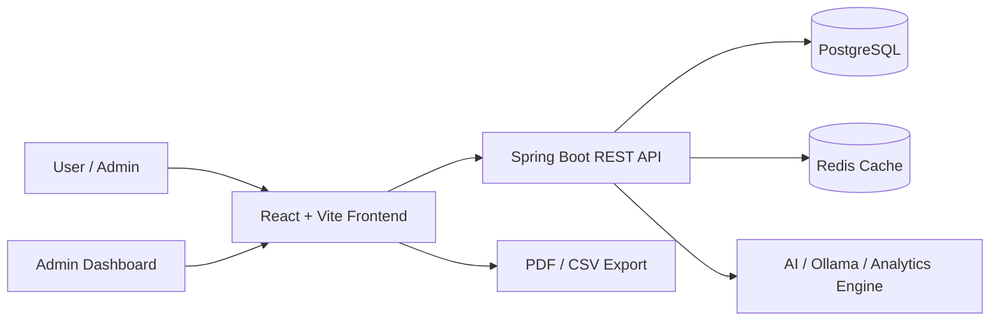

# Smart Fintech Platform

<div align="center">

  
  
  
  
  

  <h3>Smart personal finance and wealth management platform</h3>
  <p>
    A modern fintech application for tracking income, expenses, budgets, debts, recurring payments, savings goals, and investment portfolios.
  </p>

</div>

## Overview

Smart Fintech Platform is a full-stack financial management system designed to help users understand, control, and optimize their money flow. It combines a secure backend, a modern dashboard UI, and AI-powered financial insights to provide a complete personal finance experience.

The platform includes:

- Wallet and transaction management
- Smart categorization and filters
- Budget planning and alerts
- Debt tracking and repayment schedule
- Saving goals and recurring transactions
- Investment market overview
- Predictive analytics and financial summaries
- AI-powered guidance and voice-to-transaction support
- Admin dashboard and reporting tools

---

## Architecture



---

## Tech Stack

### Backend
- Java 17
- Spring Boot 3.5.15
- Spring Security + JWT
- Spring Data JPA
- PostgreSQL
- Redis
- Flyway migrations
- OpenAPI / API integration support
- Mail and OAuth2 support

### Frontend
- React 18
- TypeScript
- Vite
- React Router
- Tailwind CSS
- Recharts, FullCalendar, Tremor UI, Lucide icons
- Axios for API communication

### Infrastructure
- Docker Compose
- NGINX for frontend serving
- Postgres container
- Redis container

---

## Key Features

### Financial management
- Manage multiple wallets with balances
- Record income and expense transactions
- Categorize by type and period
- Search, filter, sort and export records

### Budgeting & planning
- Set and monitor budgets by category
- Alert when category usage nears limit
- Track recurring transaction schedules
- Follow up on saving milestones and debt obligations

### Analytics & forecasting
- Monthly financial summaries
- Category-wise expense trends
- Budget health reports
- Predictive analytics for next-month spending
- PDF and CSV export support

### AI-powered experience
- AI financial guidance and recommendations
- Voice-to-transaction extraction support
- Personalized insights based on user activity

### Admin capabilities
- Admin panel for system oversight
- Audit log and operational management
- Secure role-based access control

---

## Project Structure

```bash
smart-fintech-platform/
├── backend-saas/                     # Spring Boot backend
│   ├── src/
│   │   ├── main/
│   │   │   ├── java/com/fintech/smartwealth/
│   │   │   │   ├── config/
│   │   │   │   ├── controller/
│   │   │   │   ├── dto/
│   │   │   │   ├── entity/
│   │   │   │   ├── repository/
│   │   │   │   ├── security/
│   │   │   │   ├── service/
│   │   │   │   └── web/
│   │   │   └── resources/
│   │   └── test/
│   ├── pom.xml
│   ├── Dockerfile
│   ├── mvnw
│   └── README.md
│
├── frontend-app/                     # React frontend
│   ├── src/
│   ├── public/
│   ├── package.json
│   ├── vite.config.ts
│   ├── tailwind.config.js
│   └── Dockerfile
│
├── analytics-brain/                  # Analytics datasets / AI processing files
├── docker-compose.yml               # Full local stack setup
├── README.md                        # Project documentation
└── powerbi/                         # Reporting / BI assets
```

---

## Quick Start

### Prerequisites

- Java 17+
- Maven or Maven Wrapper
- Node.js 18+
- npm / pnpm
- Docker + Docker Compose

### Option 1: Run with Docker (recommended)

```bash
git clone https://github.com/<your-username>/smart-fintech-platform.git
cd smart-fintech-platform

docker compose up -d --build
```

After startup:

- Frontend: http://localhost:3000
- Backend API: http://localhost:8080
- PostgreSQL: localhost:5433
- Redis: localhost:6379

To view logs:

```bash
docker compose logs -f backend
```

---

### Option 2: Run backend locally

```bash
cd backend-saas

export JWT_SECRET="change-me-please-use-strong-secret-32chars!"
export SERVER_PORT="8081"
export SPRING_DATASOURCE_URL="jdbc:postgresql://localhost:5433/fintech_db"
export SPRING_DATASOURCE_USERNAME="postgres"
export SPRING_DATASOURCE_PASSWORD="123456"

./mvnw spring-boot:run
```

### Option 3: Run frontend locally

```bash
cd frontend-app
npm install
npm run dev
```

The frontend usually runs at:

```bash
http://localhost:5173
```

---

## Environment Variables

The application uses environment variables for security and integrations.

| Variable | Purpose | Default |
| --- | --- | --- |
| `JWT_SECRET` | JWT signing secret | `default-secret-key-please-change-this-32-chars` |
| `SERVER_PORT` | Backend port | `8080` |
| `SPRING_DATASOURCE_URL` | PostgreSQL database URL | `jdbc:postgresql://localhost:5433/fintech_db` |
| `SPRING_DATASOURCE_USERNAME` | Database username | `postgres` |
| `SPRING_DATASOURCE_PASSWORD` | Database password | `123456` |
| `CORS_ALLOWED_ORIGINS` | Allowed frontend origins | `http://localhost:5173` |
| `REDIS_HOST` | Redis hostname | `localhost` |
| `REDIS_PORT` | Redis port | `6379` |
| `GOOGLE_CLIENT_ID` | Google OAuth client ID | optional |
| `GOOGLE_CLIENT_SECRET` | Google OAuth secret | optional |
| `OLLAMA_URL` | Local AI provider URL | `http://localhost:11434` |
| `ANALYTICS_DATA_DIR` | Analytics data folder | `../analytics-brain` |

---

## Main API Areas

The backend exposes REST endpoints under `/api/v1` and covers major business domains:

- `Auth` — login, registration, JWT-based authentication
- `Users` — user profile and account management
- `Wallets` — wallet creation and tracking
- `Transactions` — income/expense records and advanced filtering
- `Categories` — transaction grouping and labels
- `Budgets` — category-based budget management
- `Debts` — borrow/lend tracking and due dates
- `Saving Goals` — target savings planning
- `Investments` — market prices and portfolio tracking
- `Analytics` — summaries, monthly trends, prediction, PDF/CSV export
- `AI` — voice-to-transaction extraction and financial guidance
- `Admin` — admin operations and audit logs

> The project is designed around secure access and structured financial data, with JWT protection for user-facing API routes.

---

## Screens & User Experience

The frontend dashboard focuses on usability and financial clarity:

- Overview dashboard with total balance and monthly metrics
- Recent transactions feed
- Budget and debt alerts
- Predictive analytics insights
- Portfolio and investment monitoring
- Clean responsive layout for desktop and tablet usage

---

## Development Notes

- Backend uses Flyway for schema versioning and migrations.
- Redis is used for cache support and performance optimization.
- AI features are designed to work with local Ollama-based models by default.
- Docker Compose config includes Postgres, Redis, backend, and frontend containers in a single stack.

---

## Contributing

Contributions are welcome.

```bash
git checkout -b feature/my-improvement
git commit -m "Add my improvement"
git push origin feature/my-improvement
```

Please keep the codebase consistent with the current architecture and add tests for bug fixes or new features when possible.

---

## Roadmap

Planned future improvements include:

- stronger multi-tenant organization support
- richer AI financial recommendations
- recurring payment automation improvements
- mobile-first UX refinements
- deeper investment analytics and portfolio insights
- enhanced reporting and dashboard personalization

---

## Contact

For questions, ideas, or collaboration opportunities, feel free to reach out via GitHub or email associated with the repository owner.

---

<p align="center">
  <strong>Built for smarter financial management.</strong>
</p>
